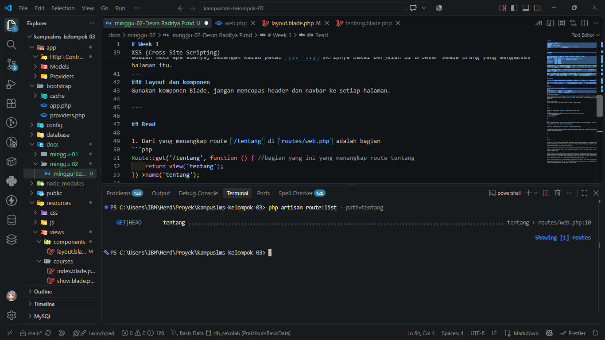

# Week 1

**Mata Kuliah: Pemrograman Web**\
**Pertemuan: 2**\
**Tanggal: 6 September 2026**\
**Topik: Route, Controller, View: Menghubungkan Frontend dan Backend**\

---

## Ringkasan

### Route
Laravel sendiri membaca route dari atas kebawah dan memilih route pertama yang cocok.
Makna masing masing method HTTP :
1. `GET`        : Untuk mengambil data dan aman diulang serta boleh di-bookmark
2. `POST`       : Untuk membuat
3. `PUT/PATCH`  : Untuk mengubah
4. `DELETE`     : Untuk menghapus

Kesalahan klasik yang sering terjadi yaitu menghapus data lewat `GET`, dengan begitu ketika suatu user mengakses `/courses/5/delete` semua data di data 5 akan terhapus.

Nama Route penting karna jika nama url berubah, kita cukup mengedit satu baris di `web.php` dibanding mencari ke seluruh folder proyek.

Dalam program Laravel urutan itu menentukan route. Contohnya kalau `/courses/{course}` ditulis sebelum `/courses/create`, maka `create` bakal disangka sebagai `{course}` dan laravel akan cari mata kuliah bernama `create`.

---
### Controller
Controller itu nggak perlu panjang panjang, karna tugasnya : menerima request, meminta data, dan menyerahkan ke view

Kalau controller sampai 50 baris buat 1 method, beberapa logika harus di pindah ke model atau kelas tersendiri.

---
### Blade
Dua syntax yang paling sering di pakai blade :
```PHP
{{ $course->name }}      //aman: HTML di-escape otomatis
{!! $course->name !!}    //BAHAYA: HTML dieksekusi mentah-mentah
```
XSS (Cross-Site Scripting)
bayangin mahasiswa daftar namanya sebagai `<script>alert(document.cookie)</script>`. Kalau pakai `{{  }}` yang tampil adalah teks apa adanya, sedangak kalau pakai `{!!  !!}` skripnya bakal berjalan di browser semua orang yang mengakses halaman itu.
---
### Layout dan komponen
Gunakan komponen Blade, jangan mencopas header dan navbar ke setiap halaman.

---

## Read

1. Bari yang menangkap route `/tentang` di `routes/web.php` adalah bagian 
```php
Route::get('/tentang', function () { //bagian yang ini yang menangkap route tentang
    return view('tentang');
})->name('tentang');

```

2. 
Route `/tentang` menggunakan method `GET` dan tidak menggunakan controller, URL langsung diarahin ke file view menggunakan `web.php` dengan perintah `return view(...)`

3. View yang dikembalikan adalah view `/tentang` di path `tentang.blade.php`

4. Layout yang membungkus tentang adalah file `layout.blade.php`, karna bisa dilihat di file `tentang.blade.php` layout di bungkus menggunakan `<x-layout>`

5. sesuai dengan gambar


bisa dilihat bahwa hasil dari `php artisan route:list --path=tentang` sama seperti yang saya telah tulis di nomor 1


---

## Break

1. Prediksi awal : Method `POST` digunakan untuk menambah, sedangkan method tersebut terletak di route index yang harusnya menampilkan bukan menambah data sehingga akan menampilkan pesan error.

Hasil : 405 Error muncul ketika mencoba mengkases `course.index`, hal tersebut terjadi karena browser itu selalu mengirimkan method `GET` ke laravel ketika kita mengakses suatu laman atau mengklik suatu button. Nah karena tidak serasi antara request method browser dengan mehtod route, Laravel menampilkan pesan bahwa program error.

2. Prediksi awal : Laravel akan memunculkan pesan error karena tujuan viewnya tidak ada atau tidak ditemukan didalam struktur file

Hasil : Kurang lebih sama dengan prediksi saya, yaitu laravel akan menampilkan error berupa viewargumentexception berupa `View [] not found.`.

3. Prediksi awal : Laman yang menampilkan `course.index` akan error dikarenakan dalam view `index.blade.php` terdapat button yang ngedirect ke view `show.blade.php`. Ketika route `course.show` tidak didefiniskan maka laravel akan bingung.

Hasil : Error muncul karena dalam view `course.index` itu memanggil `course.show` sedangkan di `web.php` itu `cours.show` tidak ada.

4. Prediksi awal : error dikarenakan route `course.create` akan dibaca sebagai id oleh sistem, sehingga sistem mencari data dengan id `create` 

Hasil : Error 404 muncul, dikarenakan file laravel membaca route dari urutan atas ke bawah. Nah karena `course.show` berada di atas `course.create` dan `course.show` menggunakan parameter dinamis yaitu`{id}`, maka nilai `create` dibaca sebagai id oleh laravel.

5. Prediksi awal : ketika `{{  }}` diganti menjadi `{!!  !!}` dan diisi degan script js, program akan membaca itu sebagai HTML mentah dari program dan menjalankan script tersebut.

Hasil : `{{ }}` melakukan escape sehingga HTML/JavaScript dari variabel `$nama` tidak di eksekusi, kalau pakai `{!! !!}` laravel bakal menganggap HTML mentah. Karna mengandung `<script>` dan menggunakan `{!! !!}`, browser menjalankannya dan menyebabkan XSS.

6. Prediksi awal : ketika `@vite` dihapus, design tidak akan muncul dikarenakan pemanggilnya yaitu `@vite` tidak ada di file `layout.blade.php`

Hasil : Sama dengan prediksi, design tidak akan muncul dikarenakan pemanggilnya yaitu `@vite` tidak ada di file `layout.blade.php`

7. Prediksi awal : Design tidak akan ke update, namun selagi sudah `npm run build` maka design tersimpan

Hasil : Kurang lebih sama dengan prediksi, design yang belum di `npm run build ` tidak ke update.

8. Prediksi awal : Akan error karena laravel tidak tau parameter yang dipanggil user

Hasil : `syntax error, unexpected token ";", expecting ")"`, nah disini nilai`id` tidak ada.